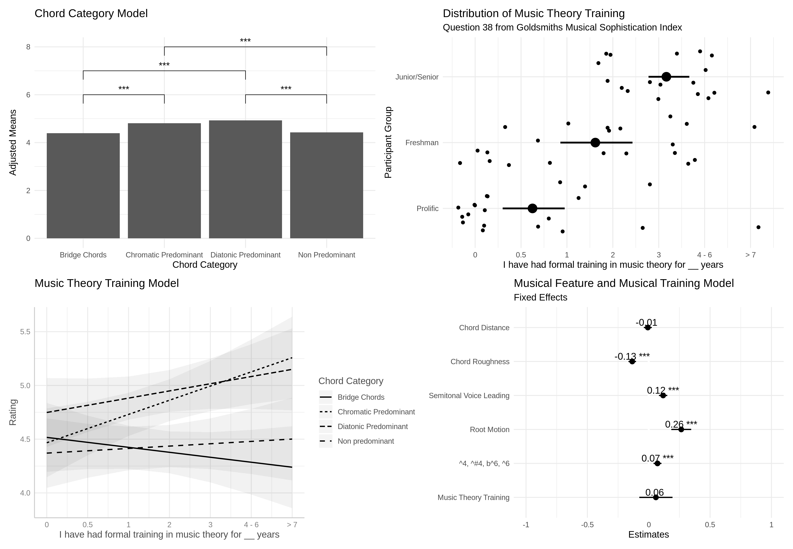
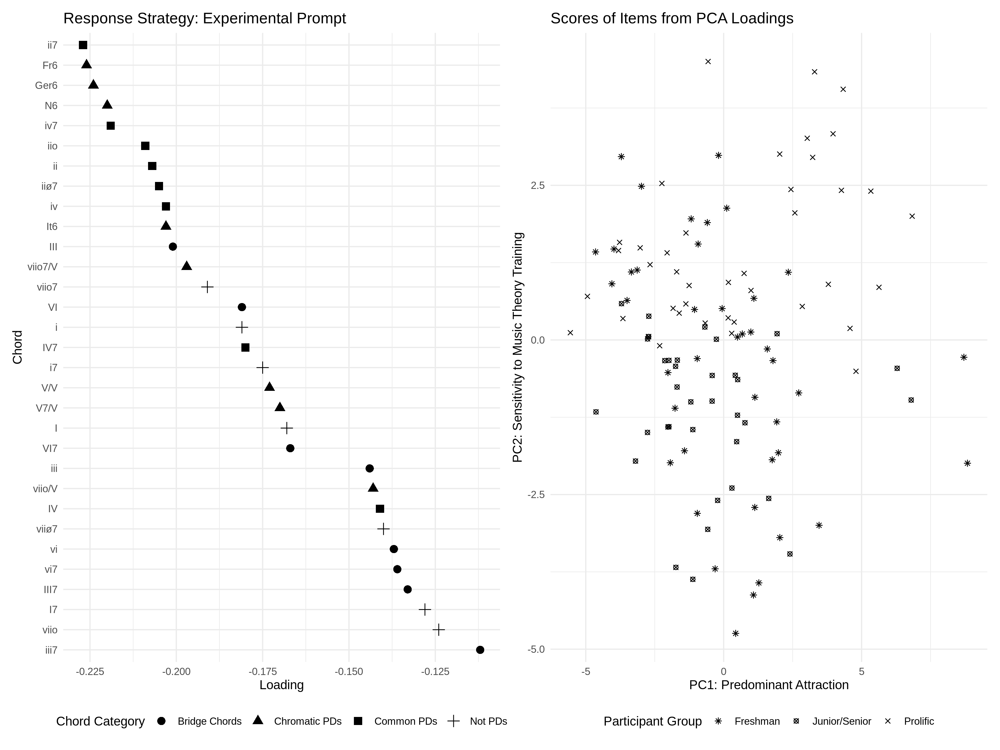

# Attraction of Pre-Dominant Chords

This repository contains the data and code for the current pre-print [The Attraction of Pre-Dominant Chords]().

## For Reviewers

* Raw data for this experiment can be found in the `data` directory. 
* Cleaned, [tidy](https://cran.r-project.org/web/packages/tidyr/vignettes/tidy-data.html) versions of the data can be found in `tidy_tables`.
* The main analyses with all data import, statisical modeling, and figure creation can be found in `Analysis Write Up`. We provide both the `.Rmd` to run the files if you would like, or a more visual friendly `.html` that provides what the markdown script renders.
* Figures used in the manuscript can be found in `img/Figures/*`.

## Statistical Analyses

Here we also present a summary of the statistical arguments put forward.

### Design 

Data from this experiment comes from a repeated measures design where participants (N = 56) rated various target chords (N = 31) based on their attraction (1 -- 7 continous scale) to the V chord in a I - Target - V - I sequence. Participants rated each chord twice. Though there was stability between conditions, we collapsed across the two experimental blocks.

The panel below shows our first statistical analysis.

### Modeling

The top left panel shows the results of a linear mixed effects model specifying chord category (a top down feature) as a fixed effect and participant as a random effect. Below that panel shows what happens when music theory is added as a fixed effect and allowed to interact with chord category. The bottom right shows a mixed effects model that specifies five computationally derived features (bottom up) with music theory training. We include a jittered display of music training across our sample space to show we sampled from across our music theory training variable. 

We then conducted a principal component analysis on our data.
The first component, pictured below left shows an empirical re-ordering of our 31 chords based on the experimental prompt. The second component, pictured left, is best described as sensitivyt to music theory training. As is evident from the chart, scores on the second PC allow for almost perfect visual separation between those from our music theory subject pool and online based soley on response data and not demographic information.

Lastly, we also subjected our chord data to a HCA per suggestion of one of our reviewers. The dendrogram is pictured below.

